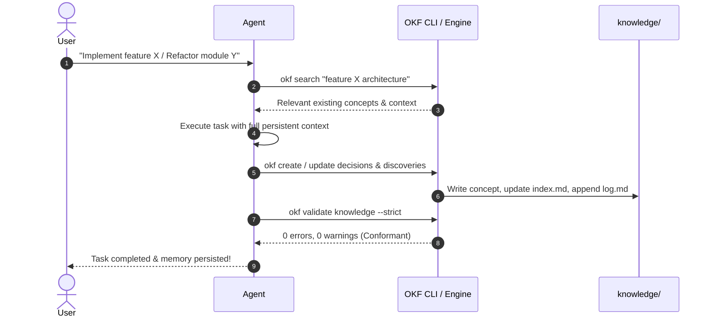

# Getting Started with OKF Agent Memory

This guide walks you through integrating and using **OKF Agent Memory** in any project—whether software development, research, coaching, or personal knowledge bases.

---

## Table of Contents

1. [Prerequisites & Installation](#1-prerequisites--installation)
2. [Adding Memory to an Existing Project](#2-adding-memory-to-an-existing-project)
3. [Starting a Brand New Project](#3-starting-a-brand-new-project)
4. [Configuring AI Agents](#4-configuring-ai-agents)
   - [Claude Code](#claude-code)
   - [Cursor / Windsurf / Antigravity](#cursor--windsurf--antigravity)
   - [Gemini CLI / Codex](#gemini-cli--codex)
5. [The Core Workflow: Read-Work-Remember](#5-the-core-workflow-read-work-remember)
6. [Daily Commands Cheat Sheet](#6-daily-commands-cheat-sheet)
7. [Best Practices](#7-best-practices)

---

## 1. Prerequisites & Installation

### Option A: Via Homebrew (macOS & Linux — Recommended)

Install with a single command via the official tap:

```bash
brew install uw-ssec/tap/okf

# Verify installation
okf version
```

### Option B: Download Pre-Compiled Release

Download the pre-compiled binary for your architecture from [GitHub Releases](https://github.com/uw-ssec/okf-agent-memory/releases):

```bash
# Example for macOS (Apple Silicon)
curl -L -o okf https://github.com/uw-ssec/okf-agent-memory/releases/latest/download/okf-darwin-arm64
chmod +x okf
sudo mv okf /usr/local/bin/

# Verify installation
okf version
```

### Option C: Build from Source

Requires Go 1.22+ (or newer):

```bash
git clone https://github.com/uw-ssec/okf-agent-memory.git
cd okf-agent-memory
make build
# Binary is available at bin/okf
```

---

## 2. Adding Memory to an Existing Project

To add persistent memory to any existing repository in a single command, run:

```bash
okf bootstrap /path/to/my-project --name "My Project Name"
```

This scaffolds four components into your project:

1. **`knowledge/`**: An OKF v0.2 bundle with root `index.md` and `log.md`.
2. **`.agents/skills/okf-memory/`**: Machine-readable skill guides for AI coding agents.
3. **`AGENTS.md`**: Agent instructions detailing the *Search-Before-Write* rule and validation workflow.
4. **`Makefile`**: Handy shortcuts (`make validate`, `make search q="..."`).

### Verify the Project Setup

```bash
cd /path/to/my-project
okf validate knowledge --strict
```

---

## 3. Starting a Brand New Project

If you are initializing a fresh repository from scratch:

```bash
mkdir my-new-project && cd my-new-project
git init
okf bootstrap . --name "My New Project"
git add .
git commit -m "chore: initialize repository with OKF agent memory"
```

---

## 4. Configuring AI Agents

### Claude Code

Claude Code automatically picks up `AGENTS.md` or `CLAUDE.md`. To configure the embedded MCP server:

Add to your `claude_desktop_config.json` or `.claude.json`:

```json
{
  "mcpServers": {
    "okf-memory": {
      "command": "okf",
      "args": ["mcp", "knowledge"]
    }
  }
}
```

### Cursor / Windsurf / Antigravity

In settings, register the Model Context Protocol (MCP) server:

* **Type**: `stdio`
* **Command**: `okf`
* **Args**: `mcp`, `knowledge`

The agent will automatically gain access to tools:
* `okf_search`: BM25 semantic concept search
* `okf_show`: Retrieve full concept details and link graphs
* `okf_create`: Create new concepts with bookkeeping
* `okf_update`: Modify existing concepts
* `okf_relate`: Link concepts together
* `okf_validate`: Audit corpus conformance

### Gemini CLI / Codex

Instruct your agent to read `AGENTS.md` and use the CLI directly:

```bash
okf search "<query>" knowledge
okf create <id> knowledge --type <type> --title "<title>" --desc "<desc>"
```

---

## 5. The Core Workflow: Read-Work-Remember

Every session with an AI agent follows a 4-step loop:



1. **Search Before Write**:
   The agent queries `okf search "<keywords>"` to inspect prior architectural choices, constraints, or schemas.
2. **Work on Task**:
   Code and documentation are implemented without hallucinating past decisions.
3. **Persist Durable Discoveries**:
   If an architectural decision, non-obvious bug fix, or domain rule was created, the agent records it via `okf create` or `okf update`.
4. **Validate & Audit**:
   Run `okf validate knowledge --strict` before closing the session to guarantee 100% OKF v0.2 conformance.

---

## 6. Daily Commands Cheat Sheet

| Task | Command |
| :--- | :--- |
| **Search knowledge** | `okf search "database auth" knowledge` |
| **Inspect a concept** | `okf show architecture/auth knowledge` |
| **Inspect raw concept markdown** | `okf show architecture/auth knowledge --raw` |
| **Create a concept** | `okf create decisions/cache-ttl knowledge --type Decision --title "Redis Cache TTL" --desc "Set default TTL to 300s."` |
| **Update a concept** | `okf update decisions/cache-ttl knowledge --desc "Extended TTL to 600s."` |
| **Connect two concepts** | `okf relate decisions/cache-ttl architecture/backend knowledge --desc "Backend uses Redis TTL config"` |
| **Validate knowledge base** | `okf validate knowledge --strict --drift` |
| **Run MCP server** | `okf mcp knowledge` |

---

## 7. Best Practices

1. **Store durable facts, not chat logs**:
   Never store raw conversational history, temporary scratchpads, or speculative thoughts. Store architectural decisions, schemas, business logic, and API contracts.
2. **Update over duplicate**:
   Always search before creating. If `architecture/auth.md` already exists, expand it rather than creating `architecture/auth-v2.md`.
3. **Respect provenance**:
   Agent writes should declare `generated: { by: "agent/<name>", at: "<timestamp>" }`. Never forge human verification.
4. **Keep index descriptions fresh**:
   Run with `--drift` to ensure that descriptions listed in folder `index.md` files match the actual concept frontmatter.
